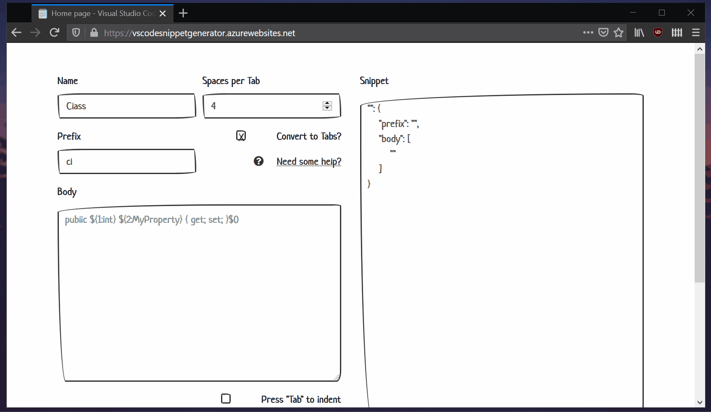

# Snippet generator for Visual Studio Code

## How To

- Fill in a form on the left side.
- Click generate and copy the snippet.
- In Visual Studio Code open `Command Palette` (`Ctrl` + `Shift` + `P`) and look for `Preferences: Configure User Snippets`.
- Pick target programming language from the list.
- Paste in the snippet into `.json` file.

## Features

- Generates snippets in Visual Studio Code format.
- Converts spaces to tabs (tabs respect Visual Studio Code indentation settings and get transformed accordingly).
- `Copy To Clipboard` button.
- Indenting by pressing `Tab`.
- `Deserialize` button for easy editing of existing snippets.
- Escapes `$` outside of `Tab Stops`.

## Build

- Run `build.cmd` script in `tools` directory.

## Requirements

- .NET Core
- LibMan CLI
- TypeScript